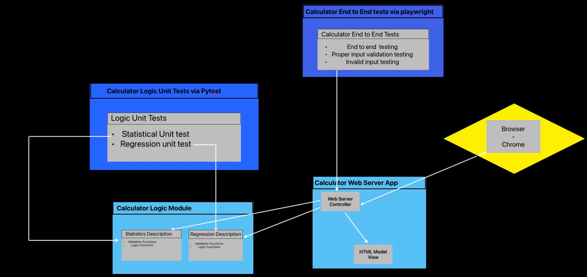
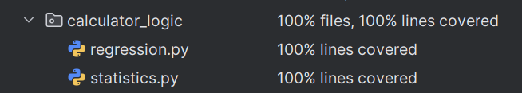

# KSU SWE 3643 Software Testing and Quality Assurance Semester Project: Web-Based Calculator

This repository contains a Web-Based calculator for statistical and linear regression operations.
The project uses Python Flask for the web server and Python for the logical backend.
Unit tests are included using pytest, and end-to-end testing through Playwright is also included.

## Table of Contents
- [Team Members](#team-members)
- [Architecture](#Architecture)
- [Environment](#environment)
- [Executing the Web Application](#executing-the-web-application)
- [Executing Unit Tests](#executing-unit-tests)
- [Reviewing Unit Test Coverage](#reviewing-unit-test-coverage)
- [Executing End-To-End Tests](#executing-end-to-end-tests)
- [Final Video Presentation](#final-video-presentation)

## Team Members
 - Colin Haskins
 - Michael Sich

## Architecture
The Web-Based Calculator architecture uses four main modules, the logic module, web server module, unit test module, and
end-to-end testing module. 



### Functional Modules
The *web server* module renders HTML templates while handling inputs and communicating with the logical module.
The *logical module* receives parameters, handles calculations, and returns values to the web module.

### Testing Modules
The *unit testing* module handles unit tests for the logical module with 100% coverage.
This module references the logical module directly and utilizes pytest for testing. 

The *end-to-end testing* module handles end-to-end Playwright testing for the web server.
Unlike the unit testing module, this module does *not* directly reference the web module, and the server must be running
for tests to function.

## Environment

This is a cross-platform application and should work in Windows 10+, Mac OSx Ventura+, and Linux environments. Note that
the application has only been carefully tested in Windows 11 and Mac OS.

### To Prepare Your Environment to Execute This Application:
 1. [Install the latest version of python for your system.](https://www.python.org/downloads/)
 2. [Ensure that pip is correctly installed, updated, and configured.](https://www.datacamp.com/tutorial/pip-upgrade-python)
 3. [Install and configure git, if not already set up.](https://git-scm.com/book/en/v2/Getting-Started-Installing-Git)
4. git Clone this repository via http to an easily accessible directory. <br>
   <br>i. Navigate to the directory you wish to clone the repository. 
   <br>ii. Clone via the following command:
    ```cmd
    git clone https://github.com/ColinHask/WebCalculator.git
    ```
 5. Download necessary dependencies by running the following command:
    <br><br>*Windows*
    ```cmd
    pip install <path-to-requirements.txt> -r 
    ```
    *Mac*
    ```terminal
    pip3 install -r <path/to/requirements.txt>
    ```
    (replace <path/to/requirements.txt> wth the actual path to the requirements.txt file)
### To Configure End-to-End Testing and Unit Testing Dependencies:
  1. [Install and configure pytest](https://docs.pytest.org/en/stable/getting-started.html)
  2. [Install and configure Playwright for Python](https://playwright.dev/python/docs/intro)

## Executing the Web Application

 1. Navigate to your project directory.
 2. Set the environmental variable for Flask with the following command:
    <br><br>*Windows*
    ```cmd
    set FLASK_APP=src/web/flaskr/app.py
    ```
    *Mac*
    ```terminal
    export FLASK_APP=src/web/flaskr/app.py
    ```
    
 3. Run the Flask app with the following command:
    <br><br>*Windows*
    ```cmd
    python -m flask run
    ```
    *Mac*
    ```terminal
    python3 -m flask run
    ```
 4.  After the application starts, launch a browser and connect to http://127.0.0.1:5000/  

If multiple Python versions are installed, ensure you're using the most recent version.
Occasionally, OneDrive paths can cause issues due to syncing. If you suspect this, try moving the project folder to a
non-synced location.

### Sample Output
```cmd
$ set FLASK_APP=src/web/flaskr/app.py
$ python -m flask run

 * Serving Flask app 'src/web/flaskr/app.py'
 * Debug mode: off
WARNING: This is a development server. Do not use it in a production deployment. Use a production WSGI server instead.
 * Running on http://127.0.0.1:5000
Press CTRL+C to quit
```

## Executing Unit Tests

 1. Navigate to the project directory.
 2. execute the following command to run pytest unit tests:
    <br><br>*Windows*
    ```cmd
    pytest src/tests/test_logic.py
    ```
    *Mac*
    ```cmd
    python3 -m pytest src/tests/test_logic.py
    ```

### Sample Output
```cmd
$ pytest src/tests/test_logic.py

================================================= test session starts =================================================
platform win32 -- Python 3.11.9, pytest-8.3.3, pluggy-1.5.0
rootdir: C:\Users\Colin\OneDrive\Desktop\REPOS\WebCalculator
plugins: anyio-4.6.0, dash-2.17.0, base-url-2.1.0, playwright-0.6.2
collected 31 items

src\tests\test_logic.py ...............................                                                          [100%]

================================================= 31 passed in 0.06s ==================================================
```

## Reviewing Unit Test Coverage

Calculator logic module unit tests receive 100% coverage<br>


## Executing End-To-End Tests

 1. [Run the Web-server following the previous instructions](#executing-the-web-application)
 2. Open a new terminal and navigate to the project directory
 3. Run the following command to start Playwright tests:
    <br><br>*Windows*
    ```cmd
    pytest src/e2e/playwright_tests.py
    ```
    *Mac*
    ```cmd
    python3 -m pytest src/e2e/playwright_tests.py
    ```
### Sample Output

```cmd
$ pytest src/e2e/playwright_tests.py

================================================= test session starts =================================================
platform win32 -- Python 3.11.9, pytest-8.3.3, pluggy-1.5.0
rootdir: C:\Users\Colin\OneDrive\Desktop\REPOS\WebCalculator
plugins: anyio-4.6.0, dash-2.17.0, base-url-2.1.0, playwright-0.6.2
collected 8 items

src\e2e\playwright_tests.py ........                                                                             [100%]

================================================== 8 passed in 3.12s ==================================================
```

## Final Video Presentation

[View Final Video Presentation Pt.1 Here](https://youtu.be/rFEc2f087cw)
<br>
[View Final Video Presentation Pt.2 Here](https://youtu.be/LStzI7o6q0c)